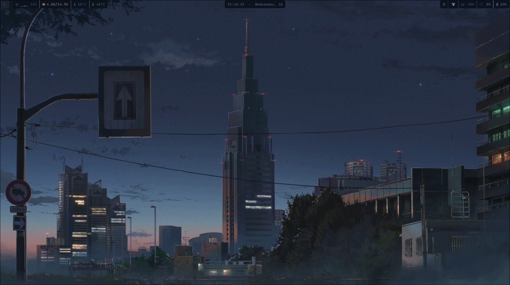

<div align="center">

# HYPRLAND DOTFILES



*A highly customized, performance-driven environment for Arch Linux.*

</div>

---

## ⛩️ Overview

Welcome to my personal configuration. This setup is built around **Hyprland**, focusing on a keyboard-centric workflow, dynamic aesthetics, and minimal resource usage. Every component has been hand-picked and tuned for a cohesive experience.

## 🍙 Rice Details

| Component | Specification |
| :--- | :--- |
| **OS** | Arch Linux |
| **Window Manager** | Hyprland |
| **Bar** | Waybar |
| **Terminal** | Kitty |
| **Shell** | Zsh + Starship |
| **Launcher** | Rofi |
| **Compositor** | Hyprland |
| **Colorscheme** | Pywal (Dynamic) |

## ✨ Features

*   **Dynamic Theming**: The entire system adapts to your wallpaper using `pywal`.
*   **Smooth Animations**: Fluid motion for windows and workspaces.
*   **Productivity**: Optimized keybindings for rapid multitasking.
*   **Minimalism**: No bloat, just the essentials.

## 💾 Installation

To replicate this setup on your machine:

```bash
# 1. Clone the repository
git clone https://github.com/rhythmcreative/hyprland.git
cd dotfiles

# 2. Run the installation script
./install.sh
```

## 🎹 Keybindings

The `SUPER` key is your command center.

| Key | Action |
| :--- | :--- |
| `SUPER + Return` | Open Terminal |
| `SUPER + A` | Application Launcher |
| `SUPER + Q` | Close Window |
| `SUPER + F` | Toggle Fullscreen |
| `SUPER + Space` | Toggle Floating |
| `SUPER + [1-9]` | Switch Workspace |
| `SUPER + Shift + [1-9]` | Move Window to Workspace |
| `SUPER + Backspace` | Power Menu |
| `SUPER + L` | Lock Screen |
| `F11 / F12` | Volume Down / Up |
| `SUPER + P` | Screenshot |

---

<div align="center">
    <i>Maintained by rhythmcreative</i>
</div>
