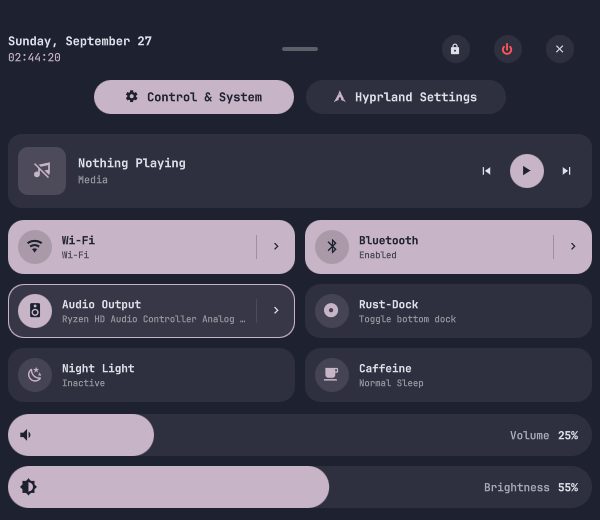
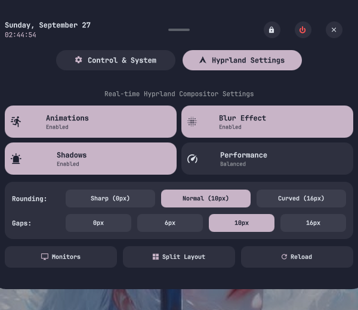
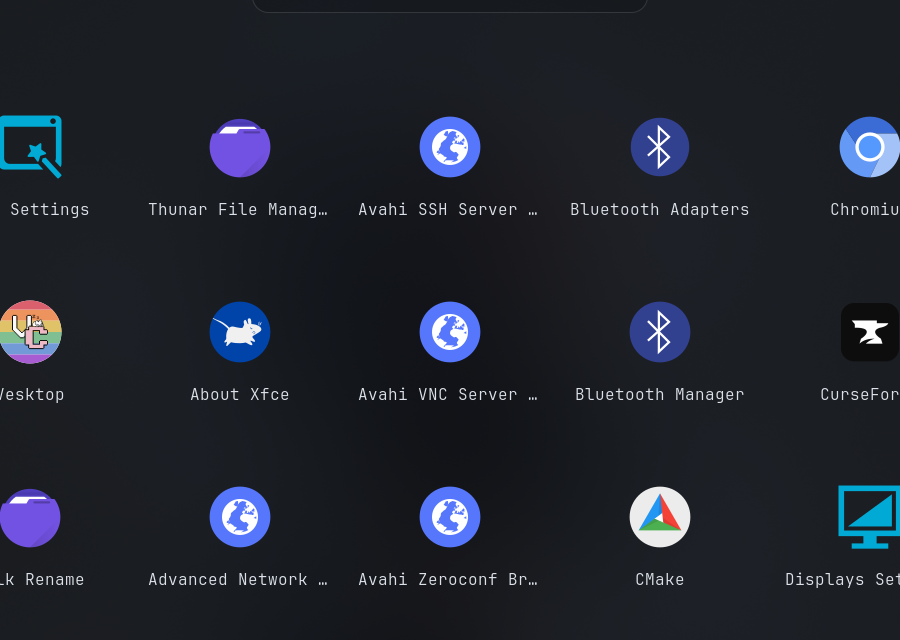

<h1 align="center">Rhythm Hyprland Dotfiles</h1>

<div align="center">
  <p><i>A modern, responsive Hyprland desktop environment powered by Quickshell Dynamic Island, Rust-Dock, and full-system Pywal palette synchronization.</i></p>
</div>

<div align="center">

[](https://archlinux.org/)
[](https://hyprland.org/)
[](https://github.com/outfoxxed/quickshell)
[](https://github.com/rhythmcreative/rust-dock)
[](https://github.com/Alexays/Waybar)
[](https://github.com/hyprwm/hyprlock)
[](https://github.com/lbonn/rofi)
[](https://github.com/dylanaraps/pywal)
[](https://github.com/sddm/sddm)

</div>

[](https://git.io/typing-svg)

<p align="center">
  
</p>

---

[](https://git.io/typing-svg)

<table>
  <tr>
    <td width="50%">
      <h3 align="center">Control & System Center</h3>
      
      <p align="center"><i>Interactive Material 3 quick toggles (Wi-Fi, Bluetooth, Audio, Rust-Dock, Night Light, Caffeine), pill sliders, and MPRIS player.</i></p>
    </td>
    <td width="50%">
      <h3 align="center">Hyprland Compositor Settings</h3>
      
      <p align="center"><i>Real-time live adjustment of window corner rounding, gaps, shadows, blur effects, animations, and monitor profiles.</i></p>
    </td>
  </tr>
</table>

---

[](https://git.io/typing-svg)

<p align="center">
  
</p>

- **High-Performance Native Dock**: Written in Rust using GTK4 and `gtk4-layer-shell`.
- **Multi-Monitor Awareness**: Automatically synchronizes and spawns across attached monitors.
- **Dynamic Theming**: Color palettes instantly adapt to the current wallpaper through Pywal CSS injection.
- **App Launching & Pinning**: Pinned application management with live running app indicators.

---

[](https://git.io/typing-svg)

<table>
  <tr>
    <td width="50%">
      <h3 align="center">Application Launcher (Super + A)</h3>
      
    </td>
    <td width="50%">
      <h3 align="center">Interactive Cheatsheet (Super + F)</h3>
      
    </td>
  </tr>
</table>

---

[](https://git.io/typing-svg)

### One-Line Quick Install

Run the installer directly from your terminal using curl:

```bash
curl -fsSL https://raw.githubusercontent.com/rhythmcreative/hyprland/main/install.sh | bash
```

### Manual Installation

Clone the repository and launch the installer:

```bash
git clone https://github.com/rhythmcreative/hyprland.git ~/.config/hyprland-repo
cd ~/.config/hyprland-repo
./install.sh
```

> [!IMPORTANT]
> Do **NOT** run `install.sh` as root or with `sudo`. The script requests root permissions with `sudo` internally when required.

### Installer Command-Line Flags

The installer supports non-interactive execution and custom overrides:

| Flag | Description |
|---|---|
| `-y`, `--yes` | Assume yes to all confirmation prompts (unattended mode) |
| `--preview`, `--dry-run` | Run visual preview mode without modifying system files |
| `--no-reboot` | Prevent automatic reboot prompt upon installation completion |
| `--wallpapers <mode>` | Pre-select wallpaper mode: `all`, `random`, or `none` |
| `--skip-wallpapers` | Skip downloading wallpaper packs |
| `--gpu <type>` | Force specific GPU driver stack: `nvidia`, `amd`, `intel`, `auto`, `none` |
| `--skip-gpu` | Skip GPU driver detection and setup |
| `--skip-rust-dock` | Skip compiling rust-dock from source |
| `--skip-flatpaks` | Skip installing Flatpak applications |
| `--replace-configs-all` | Overwrite existing configurations directly without `.bak` backups |
| `-h`, `--help` | Display CLI help and flag usage |

#### Automated Unattended Example

```bash
curl -fsSL https://raw.githubusercontent.com/rhythmcreative/hyprland/main/install.sh | bash -s -- -y --no-reboot --skip-wallpapers
```

---

[](https://git.io/typing-svg)

A curated collection of over 3,000 wallpapers is organized into downloadable packs. You can choose to download all packs or a selection during installation, or manually download individual packs:

```bash
curl -L "https://raw.githubusercontent.com/rhythmcreative/wallpapers/main/pack_1.zip" -o "/tmp/pack_1.zip"
unzip -q -o "/tmp/pack_1.zip" -d "/tmp/wallpaper_install"
cp -r "/tmp/wallpaper_install/pack_1"/* ~/Pictures/Wallpapers/
rm -rf "/tmp/wallpaper_install" "/tmp/pack_1.zip"
```

> [!NOTE]
> Wallpapers are curated from [Bjarneo Wallpapers](https://bjarneo.github.io/wallpapers/).

---

[](https://git.io/typing-svg)

| Component | Tool / Implementation |
|---|---|
| Compositor | Hyprland (Wayland) with Hyprland Plugins |
| Dynamic Island | Quickshell (Qt6 QML with IPC control) |
| Application Dock | Rust-Dock (GTK4 + gtk4-layer-shell) |
| Status Bar | Waybar with Pywal synchronization |
| Terminal | Kitty |
| Shell | Zsh with syntax highlighting and autosuggestions |
| Application Launcher | Rofi (Tokyo Night / Pywal themes) |
| Screen Locker | Hyprlock + Hypridle |
| File Manager | Thunar + Plugins & Tumbler thumbnails |
| Dynamic Theming | Python-Pywal (System-wide color coordination) |
| Wallpaper Engine | awww with smooth synchronized fade transitions |
| Audio Server | Pipewire + Wireplumber |
| Display Manager | SDDM with Astronaut Theme & Pywal sync |
| AUR Helper | yay |

---

[](https://git.io/typing-svg)

| Shortcut | Description | Category |
|---|---|---|
| `Super + Return` | Launch Terminal (Kitty) | System |
| `Super + Space` | Toggle Rust-Dock visibility | Launcher |
| `Super + I` | Toggle Dynamic Island / Notch | Dynamic Island |
| `Super + F` | Interactive Keybindings Cheatsheet | Help |
| `Super + X` | Quick Compositor Settings Menu | Settings |
| `Super + N` | Wi-Fi Network Selector Menu | Network |
| `Super + B` | Bluetooth Device Manager Menu | Network |
| `Super + A` | Application Launcher | Launcher |
| `Super + R` | Command Runner | Rofi |
| `Super + E` | Open File Manager (Thunar) | Files |
| `Super + Q` | Close Active Window | Window |
| `Super + W` | Toggle Floating Mode | Window |
| `Super + J` | Toggle Window Split / Orientation | Layout |
| `Alt + Return` | Toggle Fullscreen | Window |
| `Super + Tab` | Workspace Overview | Window |
| `Super + M` | Exit Hyprland Session | Session |
| `Super + L` | Lock Screen (Hyprlock) | Security |
| `Super + BackSpace` | Power Menu (Reboot / Shutdown) | Session |
| `Super + P` | Screenshot Region with Swappy editor | Utility |
| `Super + Shift + P` | Color Picker (Hyprpicker) | Utility |
| `Super + Shift + Print` | Instant Fullscreen Screenshot | Utility |
| `Super + Shift + W` | Wallpaper Visual Selector | Wallpaper |
| `Super + Shift + B` | Quick Random Wallpaper | Wallpaper |
| `Super + Alt + W` | Change Wallpaper + Waybar Resync | Wallpaper |
| `Super + Shift + G` | Toggle Performance Mode | System |
| `Super + 1 .. 0` | Switch to Workspace 1 to 10 | Navigation |
| `Super + Shift + 1 .. 0` | Move Window to Workspace 1 to 10 | Navigation |
| `F10` | Toggle Bluetooth | Hardware |
| `F11 / F12` | Volume Down / Volume Up | Hardware |
