<h1 align="center">rhythm's hyprland</h1>

<div align="center">
  <p><i>Personal Arch setup, customized for everyday use. </i></p>
</div>

<div align="center">

[](https://archlinux.org/)
[](https://hyprland.org/)
[](https://github.com/outfoxxed/quickshell)
[](https://github.com/rhythmcreative/rust-dock)
[](https://github.com/Alexays/Waybar)
[](https://github.com/hyprwm/hyprlock)
[](https://github.com/lbonn/rofi)
[](https://github.com/dylanaraps/pywal)
[](https://github.com/sddm/sddm)

</div>

[](https://git.io/typing-svg)

<p align="center">
  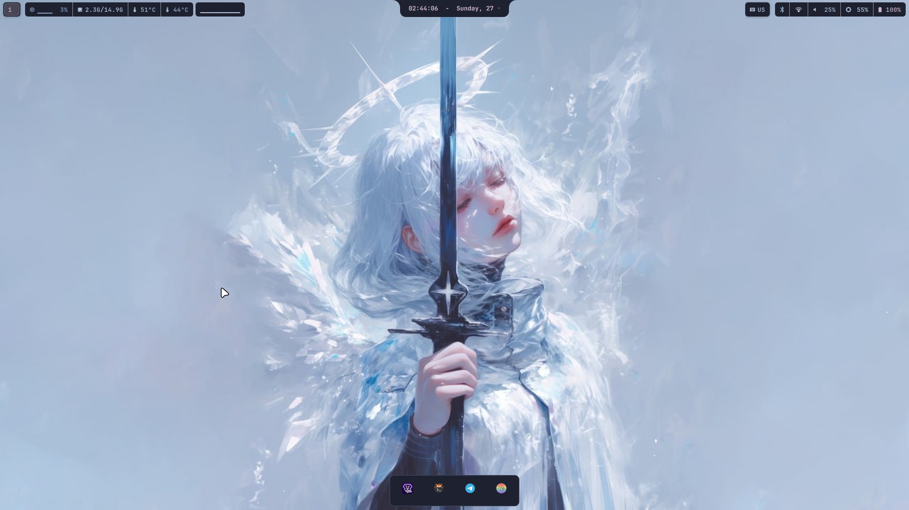
</p>

---

[](https://git.io/typing-svg)

The top notch expands smoothly on hover or via shortcut (`Super + I`), providing quick toggles, volume and brightness controls, media playback, live compositor adjustments, a screen recorder with live REC indicator, mic/camera privacy dots, Do Not Disturb mode and a built-in system updater.

<p align="center">
  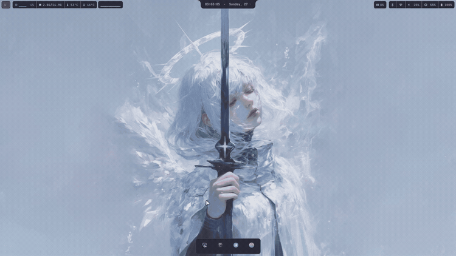
</p>

<table>
  <tr>
    <td width="50%">
      <h3 align="center">Control & system center</h3>
      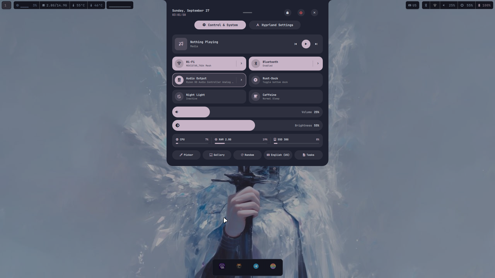
      <p align="center"><i>Quick toggles for Wi-Fi, Bluetooth, audio sinks, Rust-Dock, night light, caffeine, Do Not Disturb, volume/brightness sliders, per-app mixer and MPRIS media player.</i></p>
    </td>
    <td width="50%">
      <h3 align="center">Hyprland compositor settings (Super + X)</h3>
      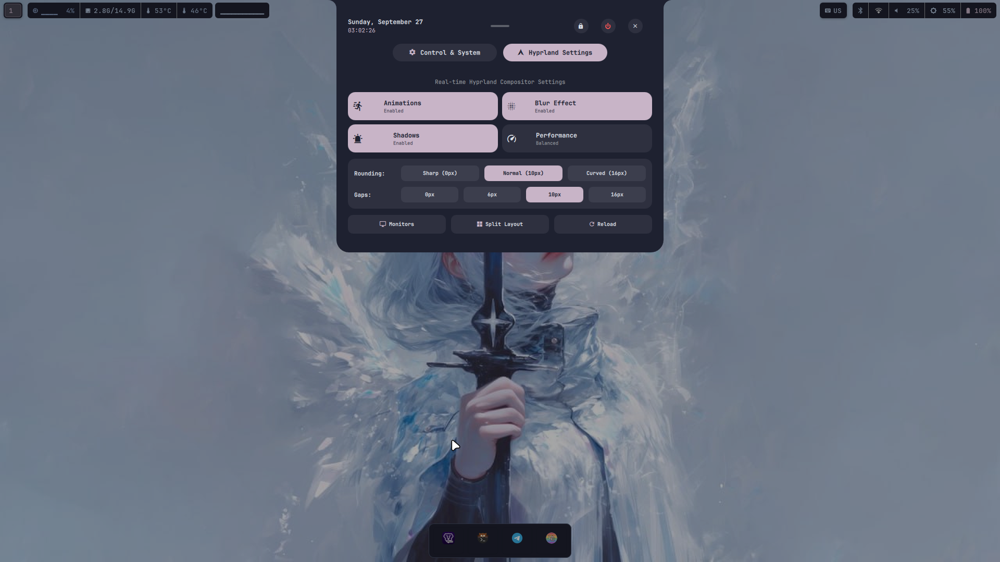
      <p align="center"><i>Live controls for corner rounding, window gaps, shadows, blur effects, animations, and monitor profiles without restarting.</i></p>
    </td>
  </tr>
</table>

---

[](https://git.io/typing-svg)

<table>
  <tr>
    <td width="50%">
      <h3 align="center">App launcher (Super + A)</h3>
      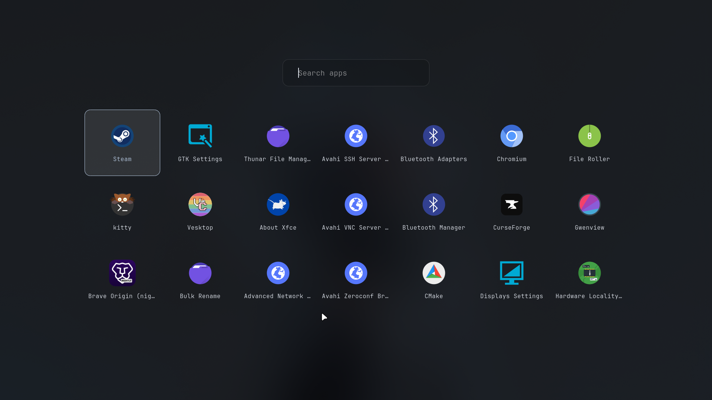
      <p align="center"><i>Fullscreen adaptive icon grid with fuzzy search.</i></p>
    </td>
    <td width="50%">
      <h3 align="center">Power menu (Super + BackSpace)</h3>
      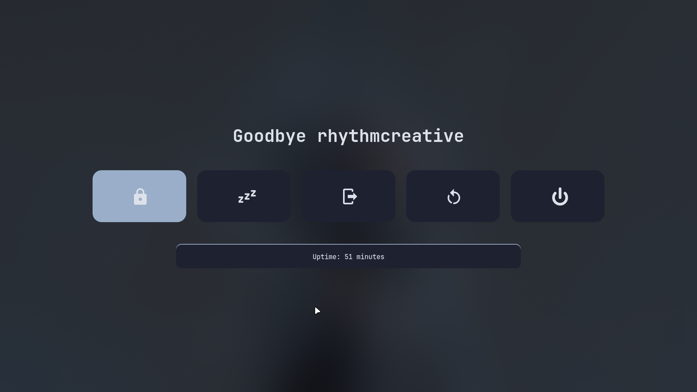
      <p align="center"><i>Quick session controls: Lock, sleep, logout, reboot, and shutdown.</i></p>
    </td>
  </tr>
  <tr>
    <td width="50%">
      <h3 align="center">Lock screen (Super + L)</h3>
      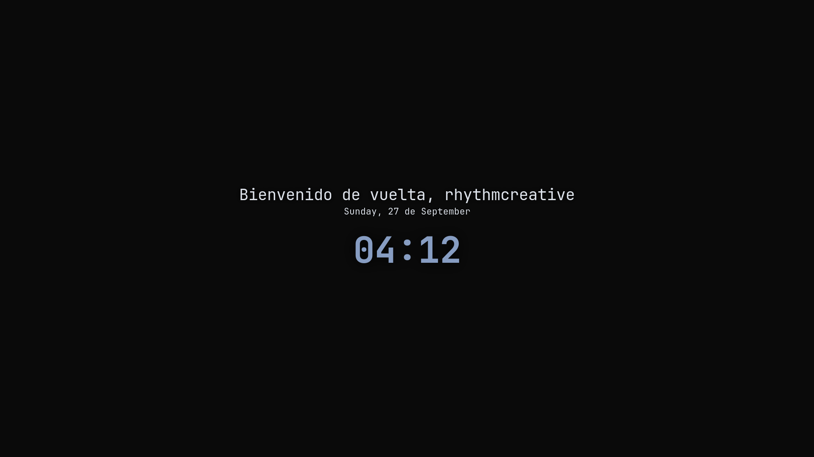
      <p align="center"><i>Hyprlock with dynamic blur, date, time, and session greeting.</i></p>
    </td>
    <td width="50%">
      <h3 align="center">SDDM astronaut login</h3>
      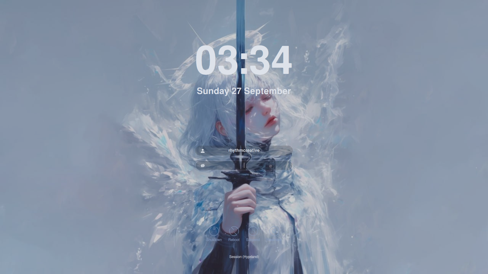
      <p align="center"><i>Astronaut display manager theme synced with current colors.</i></p>
    </td>
  </tr>
</table>

---

[](https://git.io/typing-svg)

When changing the wallpaper, Pywal automatically calculates the dominant colors and synchronizes waybar, quickshell, rust-Dock, rofi, GTK, and SDDM in real time with smooth transitions.

<table>
  <tr>
    <td width="50%">
      <p align="center"><b>Ice blue</b></p>
      
    </td>
    <td width="50%">
      <p align="center"><b>Autumn forest</b></p>
      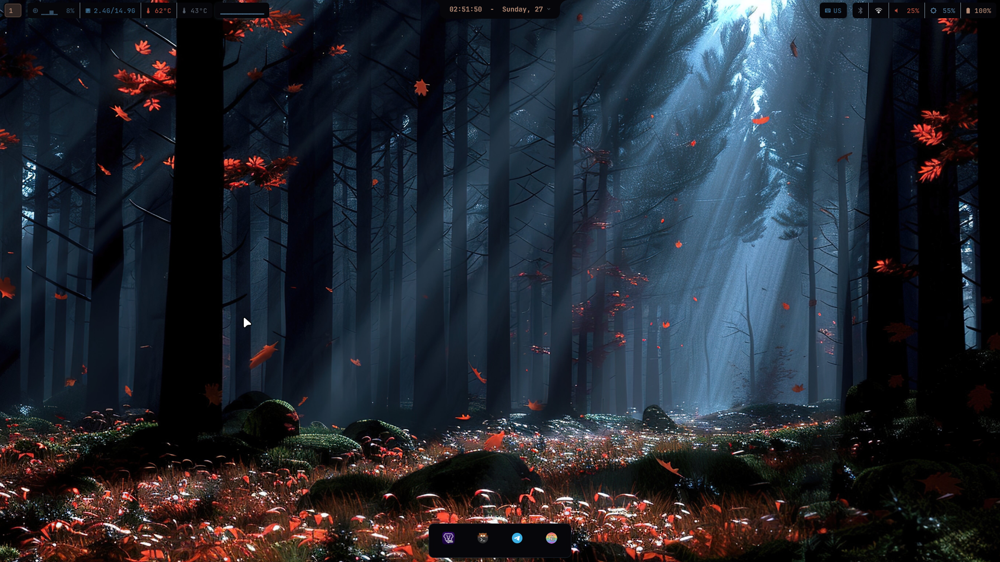
    </td>
  </tr>
  <tr>
    <td width="50%">
      <p align="center"><b>Sakura blossom</b></p>
      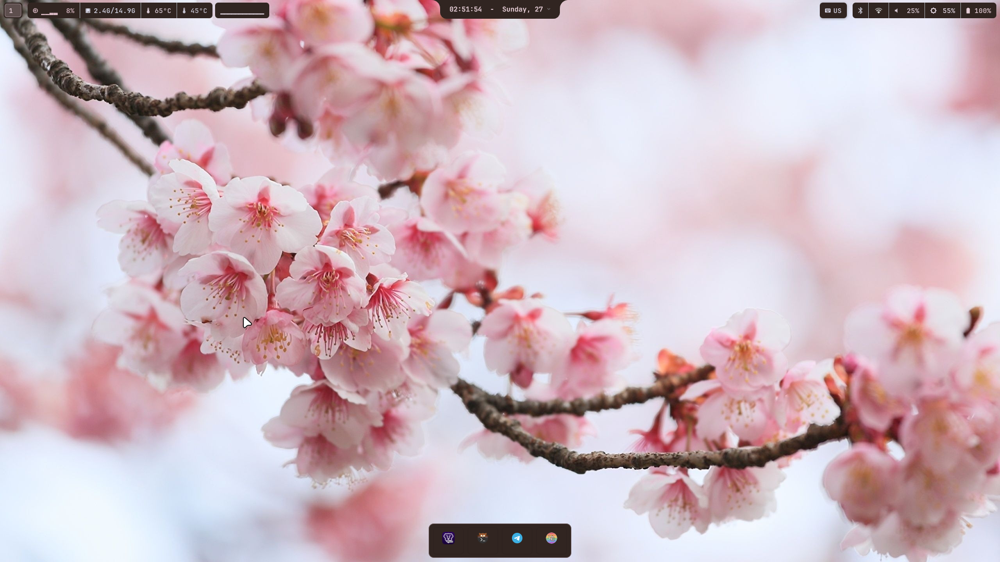
    </td>
    <td width="50%">
      <p align="center"><b>Cyberpunk neon</b></p>
      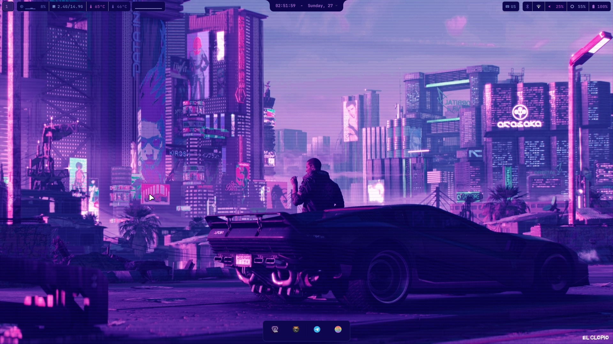
    </td>
  </tr>
</table>

> 570 wallpapers (jpg, png, webp) with animated gif, webp and mp4 support via `./install.sh --wallpapers [all|random]`. Switch anytime directly from the desktop with `Super + Shift + W` (visual selector) or `Super + Shift + B` (random fade). Curated from [FireWalls](https://github.com/deadduck-09/FireWalls).

---

[](https://git.io/typing-svg)

<p align="center">
  
</p>

Custom native dock built in Rust with GTK4 and `gtk4-layer-shell`. Features multi-monitor support, dynamic Pywal color palette adaptation, pinned applications, and active window indicators. Toggle visibility anytime with `Super + Space`.

---

[](https://git.io/typing-svg)

<p align="center">
  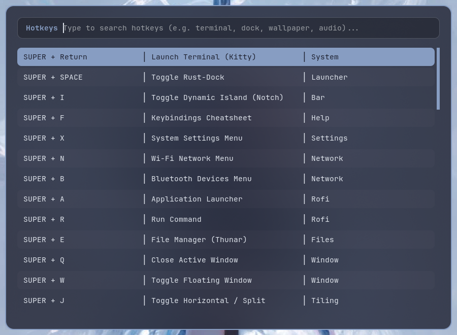
</p>

Press `Super + F` to open an interactive search cheatsheet of every shortcut configured in the system.

---

[](https://git.io/typing-svg)

One command groups 80+ helpers with per-group help, safe to use by hand or by AI agents:

```bash
rhythm commands            # list all groups and commands
rhythm wallpaper selector  # visual wallpaper picker
rhythm capture screenshot  # screenshot flows
rhythm toggle dnd          # flip Do Not Disturb
rhythm update check        # OTA status (dotfiles version + packages)
rhythm debug summary       # versions, failed services, layer counts
```

OTA updates pull the repo, run numbered idempotent migrations from `migrations/`, snapshot the system (btrfs/timeshift) and reload the desktop without logging out.

---

[](https://git.io/typing-svg)

### Quick install

Run directly from the terminal with curl:

```bash
bash -c "$(curl -fsSL https://raw.githubusercontent.com/rhythmcreative/hyprland/main/install.sh)"
```

### Manual install

Clone the repository and run the script:

```bash
git clone https://github.com/rhythmcreative/hyprland.git ~/.config/hyprland-repo
cd ~/.config/hyprland-repo
./install.sh
```

> [!IMPORTANT]
> Run the installer as your regular user, not as root or with `sudo`. Root privileges are asked via `sudo` when required.

<details>
  <summary><b>Installer flags & headless options</b></summary>

| Flag | Description |
|---|---|
| `-y`, `--yes` | Non-interactive mode, automatically confirms prompts |
| `--preview`, `--dry-run` | Visual simulation mode without applying changes |
| `--no-reboot` | Skip reboot prompt at the end |
| `--wallpapers <mode>` | Pre-select wallpaper mode: `all`, `random`, or `none` |
| `--skip-wallpapers` | Skip downloading wallpaper packs |
| `--gpu <type>` | Override GPU driver stack: `nvidia`, `amd`, `intel`, `auto`, `none` |
| `--skip-gpu` | Skip GPU driver detection |
| `--skip-rust-dock` | Skip building rust-dock |
| `--skip-flatpaks` | Skip installing Flatpaks |
| `--replace-configs-all` | Overwrite existing configurations directly without backups |
| `-h`, `--help` | Show available options |

```bash
# Example unattended run
bash -c "$(curl -fsSL https://raw.githubusercontent.com/rhythmcreative/hyprland/main/install.sh)" -- -y --no-reboot --skip-wallpapers
```

</details>

---

[](https://git.io/typing-svg)

Press **`Super + F`** anytime on your desktop to search all shortcuts interactively.

> Most entries below are direct keybindings and fire on their own. The ones marked
> *(via `Super + F`)* are **not** bound to a key: they are actions the cheat sheet
> runs for you. Press `Super + F`, find the entry, hit enter. The three scripts
> behind them are `panic-mode`, `toggle-scratchpad` and `layout-preset`.

| Shortcut | Action |
|---|---|
| `Super + Return` | Launch terminal (Kitty) |
| `Super + Space` | Toggle Rust-Dock |
| `Super + I` | Toggle dynamic island (notch) |
| `Super + F` | Interactive keybindings cheatsheet |
| `Super + X` | Quick compositor settings |
| `Super + A` | Application launcher |
| `Super + R` | Run command | Rofi command runner |
| `Super + E` | File manager (Thunar) |
| `Super + Q` | Close focused window |
| `Super + BackSpace` | Power menu (reboot / shutdown / sleep) |
| `Super + Ctrl + D` | Do Not Disturb toggle |
| `Super + Alt + 1/2/3` | Layout presets (code / reading / float) *(via `Super + F`)* |
| `Super + Esc` | Panic mode (hide all + mute) *(via `Super + F`)* |

<details>
  <summary><b>View complete keybindings list (30+ shortcuts)</b></summary>

| Shortcut | Action | Description |
|---|---|---|
| `Super + Return` | Launch terminal | Opens Kitty terminal |
| `Super + Space` | Toggle Rust-Dock | Shows or hides the bottom dock |
| `Super + I` | Toggle dynamic island | Expands or collapses the notch |
| `Super + F` | Hotkeys cheatsheet | Interactive keybinding search |
| `Super + X` | Quick settings | Fast Hyprland compositor controls |
| `Super + N` | Wi-Fi menu | Select and connect to networks |
| `Super + B` | Bluetooth menu | Pair and connect devices |
| `Super + A` | Application launcher | Rofi grid launcher |
| `Super + R` | Run command | Rofi command runner |
| `Super + E` | File manager | Opens Thunar |
| `Super + Q` | Close window | Closes focused window |
| `Super + W` | Toggle floating | Switches between tiled and floating |
| `Super + J` | Toggle split | Toggles horizontal / vertical split |
| `Alt + Return` | Fullscreen | Toggles window fullscreen |
| `Super + Tab` | Workspace overview | Visual overview of workspaces |
| `Super + M` | Exit session | Exits Hyprland |
| `Super + L` | Lock screen | Hyprlock |
| `Super + BackSpace` | Power menu | Shutdown, reboot, sleep options |
| `Super + P` | Screenshot | Slurp selection into Swappy editor |
| `Super + Shift + P` | Color picker | Hyprpicker hex copy |
| `Super + Shift + Print` | Full screenshot | Instant capture |
| `Super + Shift + W` | Wallpaper selector | Visual wallpaper picker |
| `Super + Shift + B` | Random wallpaper | Sets a random wallpaper |
| `Super + Shift + G` | Performance mode | Toggles animations and blur for gaming |
| `Super + Alt + 1/2/3` | Layout presets | Code, reading and float window layouts |
| `Super + Ctrl + D` | Do Not Disturb | Silence notifications, keeps history |
| `Super + Ctrl + W` | Wallpaper selector *(via `Super + F`)* | Visual wallpaper picker |
| `Super + Alt + M` | Noise suppression | RNNoise mic filter toggle |
| `Super + Esc` | Panic mode | Hide windows and mute instantly |
| `Super + 1 .. 0` | Switch workspace | Move to workspace 1 through 10 |
| `Super + Shift + 1 .. 0` | Move to workspace | Move active window to workspace 1 to 10 |
| `F10` | Toggle bluetooth | Hardware toggle |
| `F11 / F12` | Volume down / up | Fine audio tuning |

</details>

---

<details>
  <summary><b>Installed components & tools</b></summary>

| Component | Tool |
|---|---|
| Compositor | Hyprland with official plugins |
| Dynamic island | Quickshell (Qt6 QML with IPC) |
| Dock | Rust-Dock (GTK4 + gtk4-layer-shell) |
| Status bar | Waybar with Pywal colors |
| Terminal | Kitty |
| Shell | Zsh with syntax highlighting and autosuggestions |
| Launcher | Rofi with Pywal themes |
| Lockscreen | Hyprlock + Hypridle |
| File manager | Thunar + Plugins & Tumbler |
| Theming | Pywal (System-wide dynamic color synchronization) |
| Wallpaper engine | awww for static plus mpvpaper for animated gif, webp and mp4 |
| System CLI | rhythm unified command with 11 groups |
| Updates | OTA updater with migrations and pre-update snapshots |
| Audio | Pipewire + Wireplumber |
| Display manager | SDDM astronaut theme with Pywal hook |
| AUR helper | yay |

</details>

---

<details>
  <summary><b>Making it yours without losing it on update</b></summary>

Everything under `~/.config` comes from this repo and is refreshed on every
update. There is one place for your own changes, and it is loaded last, so it
wins without opting out of anything new the repo adds.

| File | For |
|---|---|
| `~/.config/hypr/user.lua` | Extra keybinds, window rules, animation tweaks |
| `~/.config/kitty/user.conf` | Terminal settings |

Both are gitignored, so an update can never ship them over the top. Hyprland
loads `user.lua` through `loadfile` inside `pcall`, so a typo there drops only
your part and not the whole desktop. `user.lua.example` ships commented, with
the usual cases.

If you edit a repo-owned file by hand anyway, `rhythm-materialize` notices that
its bytes match neither what it laid last time nor what the repo ships, moves it
into `~/.local/state/rhythm/user_edits/` before overwriting, and tells you. The
edit survives as a fork of that one file.

Colour files (GTK 3/4, Rofi, Mako) are deliberately not in this repo. They are
generated on your machine by pywal, so an update cannot revert them to a stale
palette.

</details>

<details>
  <summary><b>Maintenance</b></summary>

| Command | What it does |
|---|---|
| `system-ota update` | Pull the repo, deploy, resync colours, reconcile, reload services |
| `rhythm-doctor` | Report anything drifted or not delivered |
| `rhythm-doctor --fix` | Repair what is repairable |
| `rhythm-materialize --status` | Show your overrides and the deploy ledger |
| `rhythm` | Unified CLI, 11 groups |

`rhythm-doctor` exists because a deploy structurally cannot reach everything:
`/etc/sddm/Xsetup` is installed once outside `~/.config`, so before the doctor a
fix to it reached the repo and no machine that had already installed. It runs at
the end of every update, and its findings count as update problems rather than
being silently dropped.

State lives under `~/.local/state/rhythm/`, not `~/.config`, so the deploy can
never overwrite it. The battery charge limit is there too, reapplied at every
login by `rhythm-battery-limit.service`, because the kernel does not keep
`charge_control_end_threshold` across reboots.

</details>

---

<p align="center">
 Made with ❤️ from rhythmcreative
</p>
